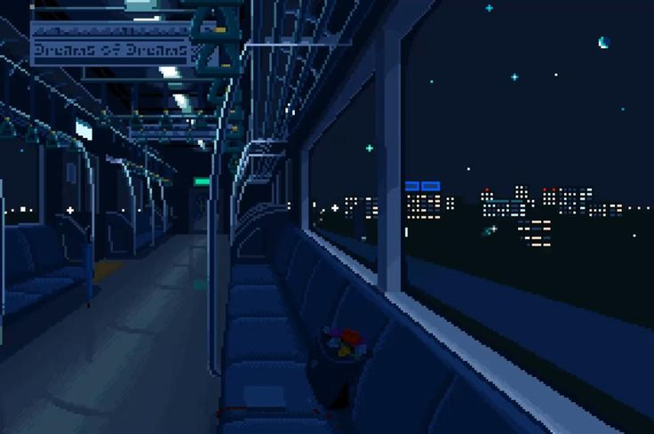

<!-- Banner -->

  

###

###

  <h3 align="left">Linguagens e ferramentas:</h3>
  

  
  
  
  
  
  
  
   
      
       
        
        
       
    
      
## 🛠️ O que estou aprendendo

- 📱 **Mobile:** Kotlin + Jetpack Compose para Android — foco em experiências fluidas e interfaces modernas.
- 🌐 **Web:** HTML, CSS e JavaScript para interfaces responsivas e acessíveis.
- 🗄️ **Dados:** Estudando MongoDB e bancos de dados NoSQL. *(em progresso)*
- 💡 **Base técnica:** Lógica de programação e algoritmos em constante evolução.

---

## 🎯 Objetivos

- 🔀 **Tornar-me desenvolvedor full-stack** — Unir mobile com Android/Kotlin, web com HTML, CSS e JavaScript, e back-end com Python, dominando todo o ciclo de desenvolvimento de um produto.
- 🚀 **Construir projetos reais** — Colocar em prática o que aprendo criando aplicações completas, do front-end ao banco de dados.

---

*Estudante em jornada — cada linha de código é um passo a mais.* 🚀

